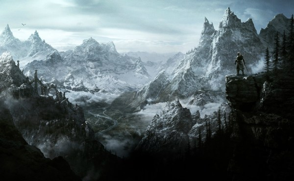

#Mis juegos favoritos
##Halo 5

Visualmente digo sin miedo a equivocarme que es el mejor Halo al que se puede jugar. Incluyendo la remasterización de la TMCC, Halo 5 brilla en su apartado técnico como pocos y es el primer Halo que podemos considerar de nueva generación con todos los derechos. Lo mejor de todo es que mantiene el nivel en todo momento, no he notado en ningún momento de la campaña, ni siquiera en aquellos momentos con muchos elementos en pantalla, una caída del frame-rate, por lo que la experiencia, en conjunción con el sonido es de matrícula.

Además, sin perder esa estética de ciencia-ficción clásica de la franquicia, la iluminación dinámica y el sistema de partículas y dibujado es sobresaliente. En este apartado quizás mi mayor pega es que las físicas de los enemigos todavía flojean, sobre todo de cara a las explosiones, que de vez en cuando son erráticas y rompen un poco la magia. En consecuencia, el manejo de muchos de los vehículos disponibles sigue siendo confuso y, en según que puntos de la campaña, sigue siendo desesperante -aunque también es una seña de identidad de la franquicia-.

##Gears of War 4

Quizás uno de los títulos que más expectación ha levantado desde que Microsoft lo enseñase en aquel E3 con un gameplay oscuro y sin mucha acción. Lógicamente, no sabíamos que bajo ese título se escondía un Gears of War de los clásicos, de los que convirtieron la franquicia en una de las mayores vende consolas y que redefinió el concepto del multijugador en tercera persona.

Ahora, y ya con una fecha de lanzamiento sobre la mesa anunciada este E3 2016 (11 de octubre de 2016), hemos podido probar un poco de la campaña de Gears of War 4, y lo cierto es que se han despejado la mayoría de dudas que se tenían tras ese trailer-gameplay del E3 de 2016: Gears of War 4 sigue siendo el mismo Gears de siempre, nada de survival horror y de sustos a traición, es un juego de acción en tercera persona que recoge todo lo bueno de las entregas anteriores e introduce elementos nuevos en forma de enemigos, tipos de combate y armas (al menos por lo que hemos visto de momento).

Gears of War 4 es la continuación de último título, ahora 25 años después y ya con el hijo de Marcus Fenix y una nueva escuadra. El nivel que hemos probado, correspondiente a los primeros momentos del juego, tanto nosotros como jugador, como los protagonistas de la historia, van descubriendo las nuevas adiciones del juego, y también que lo que funciona se ha mantenido intacto: el sistema de coberturas, los movimientos, algunas animaciones, el sistema de recarga o la disposición del inventario son indénticos al resto de entregas y rescata, de hecho, algunos de los cambios introducidos en la versión remasterizada del primer título.

##The Elder Scrolls V: Skyrim

El mundo abierto de Skyrim es una lección de diseño en este género y cualquier otro. Cierto es que la Los Santos de GTA V es una ciudad sumamente rica y viva o que la Novigrado de The Witcher 3 es una de las mejores urbes jamás vistas en un RPG pero Skyrim sigue teniendo toda la magia que nos sorprendió hace cinco años. Donde destaca la obra de Bethesda es en su forma de salpicar con decenas de zonas de interés un extensísimo y variado mapeado. Esa sensación constante de asombro y descubrimiento, pudiendo toparnos con la cabaña de una adorable anciana que esconde un terrible secreto en su sótano o recoger un diario que nos lleve a desentrañar el misterio tras una gran leyenda, sigue estando ahí, vertebrando cada partida.
